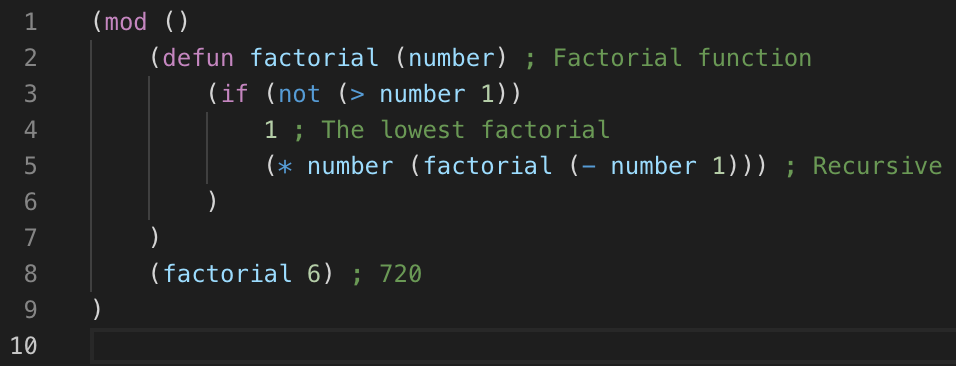

# Chialisp Language Support
This is an unofficial Visual Studio Code extension that provides syntax highlighting for [Chialisp](https://chialisp.com), which is made by the [Chia](https://chia.net) team. This language is a variation of Lisp, and the highlighting is similar, but with highlighting for the symbols that Chialisp specifically uses.

## Features
Describe specific features of your extension including screenshots of your extension in action. Image paths are relative to this README file.

For example if there is an image subfolder under your extension project workspace:

## Release Notes

### 1.0.0
The intial release of this extension. It supports all of the existing Chialisp operators, keywords, literals, and functions.